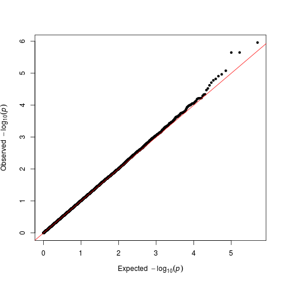

# Sigmod
## Introduction
Sigmod est une méthode exacte et efficace pour identifier un module associé à une maladie fortement interconnecté dans un réseau de gènes.  
Cette méthode fait partie des méthodes fondées sur la connaissance qui ont été proposées pour l'analyse intégrative et conjointe de plusieurs gènes.  
Il s'agit d'une analyse assistées par réseau qui superposent les P-values au niveau des gènes sur un réseau de gènes (GeneNet) pour rechercher des gènes connectés (également appelés module de gène) enrichis en signaux d'association.  
Cette analyse repose sur le principe de *"culpabilité par association"*, qui stipule que les gènes (ou produits de gènes) connectés dans un réseau participent aux mêmes fonctions cellulaires, ou sont apparenté.  
### Limitations
Ces méthodes sont limité par le fait que la plupart  recherchent souvent des modules en utilisant des algorithmes heuristiques ou “greedy”, qui ne peuvent donc pas garantir l'identification du module enrichi en signaux les plus élevés, et sont susceptibles d'inclure par hasard des gènes biologiquement non pertinents. De plus, beaucoup d'entre eux ne prennent pas en compte les poids des arêtes  pendant le processus de recherche de module, alors que celle-ci représentent la confiance ou la force des connexions entre les gènes et peuvent contenir des informations utiles.
### Méthodologie
  
 Documentation disponible sur [link to SigMod](https://github.com/YuanlongLiu/SigMod)
#### Mapping SNPs-Genes
Implémenter dans le script `ensemble.R`.
```
library(EnsDb.Hsapiens.v75)  
library(SNPlocs.Hsapiens.dbSNP144.GRCh37)  
```
Input:  
* __BP.B37-final.map__: snp location (__BP.B37-final.bed/bim/fam__) recoder au format map
Output:
* __gene_snp.txt__: space-delimited two-column text file that contains information of which SNPs are mapped to which genes.

#### Gene-level P-values
Implementer dans le script `test_fastCGP.R`. Documentation disponible sur [link to fastCGP](https://github.com/YuanlongLiu/fastCGP)

fastCGP is written in R. fastCGP requires three inputs:

* __snp2gene_file__: (the path of) a space-delimited two-column text file that contains information of which SNPs are mapped to which genes. The column headers of this file should be exactly gene and SNP (order insensitive).

An example:
```
gene SNP
KCNIP4 rs10000010
KIAA1530 rs10000012
BMPR1B rs10000023
FAM114A1 rs10000037
STK32B rs10000042
STK32B rs10000062
```

* __snp_chr_pos_p_file__: (the path of) a space-delimited four-column text file that contains the information of all SNPs that are analyzed in a GWAS, including the name of a SNP, its chromosomal number, position on the chromosome, and GWAS association p-value. The column headers of this file should be exactly SNP, chr, pos, and p (order insensitive). More SNPs contained in this file will lead to better precision of the result.

An example:
```
SNP chr pos p
rs1000000 12 126890980 0.394150
rs10000010 4 21618674 0.821190
rs10000012 4 1357325 0.623990
rs10000013 4 37225069 0.081821
rs10000017 4 84778125 0.211210
rs1000002 3 183635768 0.305950
```
Calcul des P-values: `multi-pca.py`  

QQplot sur R:
```sh
awk '{print$9}' low_ld.assoc.logistic > pvalue_association.txt
```
```r
library(qqman)

t_3=read.table("pvalue_association.txt",header=TRUE)

png(filename = "assoc_wcovar_qq.png")

qq(pvector = t_3$P)

dev.off()
```

```sh
# Pour avoir un fichier dont l'en-tête respect snp_chr_pos_p_file
awk '{print$2" "$1" "$3" "$9}' low_ld.assoc.logistic > ~/stage/SigMod_v2/snp_pval.txt
var='SNP chr pos p'
sed -i "1s/.*/$var/" ~/stage/SigMod_v2/snp_pval.txt

```


* __genes2compute_file (optional)__: (the path of) a one-column text file that contains the list of genes which you want to compute their p-values. The column header of this file should be exactly gene. If this file is not provided, all genes included in the snp_chr_pos_p_file will be computed.

An example:
```
gene
MICA
S1PR3
C6ORF15
HLA-DQA1
ZNF329
TCF19
```

Given these files, run the following code to compute gene p-values:
```
results = fastCGP( snp2gene_file, snp_chr_pos_p_file, genes2compute_file )
```
The results will be saved in results as a data frame, and will be saved in the computed_gene_p_values.tab file in your working directory.


#### Node-scored network
`SigMod_test.R`: construction automatique d'un réseau scoré par l'intermédiaire de la récupération en ligne des informations d'interaction gène/protéine de la base de données STRING
* __gene_ps__: A data frame specifying the genes and their associated p-values. This data
frame should include a “gene” column and a “p” column. Extra columns can exist but will
be ignored

* __gene_scores__: A data frame specifying the genes and their associated scores. This data frame should include a "gene'' column and a "score'' column. Extra columns can exist but will be ignored. Either a gene_scores or a gene_ps should be provided to run the construct_string_net function. If gene\_ps is provided, the p-values will be automatically converted to scores by calling the p2score function.
L'output de cette fonction est un réseau de nœud scoré au format de réseau igraph = __scored_net__

#### Identify module from the scored_net

```
res_info = SigMod_bisection( net=scored_net )
```
Output ( results will be saved under the working folder):
* __SigMod_computation_details.Rdata__: the return of the SigMod_bisection as described above
* __selected_genes.tab__: a tab delimited text le that contains the genes in the selected module
* __selected_genes_next.tab__: a tab delimited text le that contains the genes in the subsequent module of the selected module that deserves to have a look
* __selected_module.pdf__: the plot of the selected module
* __selected_module_next.pdf__: the plot of the subsequent module
* __hist_selected_genes_p_values.pdf__: a histogram of the p-values of the genes in the selected module and the genes in the whole network. This plot will be created if a gene p-values data is used to construct the scored network
* __hist_selected_genes_next_p_values.pdf__: a histogram of the p-values of the genes in
the subsequent module and the genes in the whole network. This plot will be created if a
gene p-values data is used to construct the scored network
* __selected_module.pdf__ : the plot of the selected module
* __selected_module_next.pdf__: the plot of the subsequent module
* __selected_module_interactions.tab__: the interactions in the selected module
* __selected_module_next_interactions.tab__: the interactions in the subsequent selected
module

#### Post-analyses
`post_analysis.R`  
Analyses:
* __David__  
Ensembl name convert to Ensembl IDs For DAVID analysis
* __Psygenet data Bipolar__  
 Ensembl IDs convert to HUGO symbole For Psygenet analyses  

Input:
* __selected_genes.tab__: a tab delimited text that contains the genes in the selected module
* __tab3b.tsv__: contient la liste des gènes associé à la bipolarité donnée par Psygenet  

Output:
* __gene_liste.txt__: ensembl_gene_id
* __gene_hugo_symbole.txt__: hgnc_symbol
* __common_genes_psygenet.txt__: liste des gènes en commun entre les résultats de SigMod et Psygenet
---------------
## Resultats


### Genotyped
* \#SNPs: 250141
* \#genes: 36638
* \#noeud STRING: 12031
* \#genes Output SigMod: 91

Resultats de la recherche de module par SigMod dans les fichiers **selected_module.\***


#### DAVID
Résultats de l'analyse de GO termes dans le fichier __results_GO.txt__:  

__Gene Group 1__: 	Enrichment Score: 2.2660355190877097


ENSEMBL_GENE_ID |	Gene Name
------ | ---
ENSG00000186452 |	transmembrane protease, serine 12(TMPRSS12)
ENSG00000254834 |	olfactory receptor family 5 subfamily M member 10(OR5M10)
ENSG00000116329 |	opioid receptor delta 1(OPRD1)
ENSG00000170605 |	olfactory receptor family 9 subfamily K member 2(OR9K2)
ENSG00000179055 |	olfactory receptor family 13 subfamily D member 1(OR13D1)
ENSG00000170929 |	olfactory receptor family 1 subfamily M member 1(OR1M1)
ENSG00000119714 |	G protein-coupled receptor 68(GPR68)
ENSG00000171517 |	lysophosphatidic acid receptor 3(LPAR3)
ENSG00000152034 |	melanin concentrating hormone receptor 2(MCHR2)
ENSG00000165202 |	olfactory receptor family 1 subfamily Q member 1(OR1Q1)
ENSG00000169488 |	olfactory receptor family 4 subfamily K member 15(OR4K15)
ENSG00000172289 |	olfactory receptor family 10 subfamily V member 1(OR10V1)
ENSG00000127364 |	taste 2 receptor member 4(TAS2R4)
ENSG00000121764 |	hypocretin receptor 1(HCRTR1)
ENSG00000181072 |	cholinergic receptor muscarinic 2(CHRM2)
ENSG00000186881 |	olfactory receptor family 13 subfamily F member 1(OR13F1)

__Gene Group 2__:	Enrichment Score: 2.0456063577340067


ENSEMBL_GENE_ID |	Gene Name
------ | ---
ENSG00000103769 |	RAB11A, member RAS oncogene family(RAB11A)
ENSG00000167964	| RAB26, member RAS oncogene family(RAB26)
ENSG00000099246	| RAB18, member RAS oncogene family(RAB18)
ENSG00000168118	| RAB4A, member RAS oncogene family(RAB4A)
ENSG00000119729	| ras homolog family member Q(RHOQ)
ENSG00000117280 |	RAB29, member RAS oncogene family(RAB29)


#### Psygenet Bipolarité
 Sur les 502 gènes de Psygenet 354 sont présents dans la liste d'entrée de SygMod

Gene Symbol | Gene Description
------ | ---
MCHR2  | melanin-concentrating hormone receptor 2
CHRM2 | cholinergic receptor, muscarinic 2
ADCY2 | adenylate cyclase 2 (brain)

P-value test hypergeometrique:
```r
phyper(3,354,12031-354,91)
#[1] 1.440824
phyper(3,354,12031-354,91,lower.tail=F)
#[1] 0.2795878
phyper(3,354,12031-354,91)*2
#[1] 1.440824
phyper(3,354,12031-354,91,lower.tail=F)*2
#[1] 0.5591756
```
Interval de confience test hypergeometrique:
```r
qhyper(0.01,354,12031-354,91)
#0
qhyper(0.01,354,12031-354,91,lower.tail=F)
#7
qhyper(0.01,354,12031-354,91)*2
#0
qhyper(0.01,354,12031-354,91,lower.tail=F)*2
#14
```
#### Analyse du type et de la force des liens entre ces 3 gènes sur STRING:
 

Evidence suggesting a functional link:  
* ADCY2 <-> MCHR2: *Combined Score:	0.900*

Type of Evidence| Description
----|----
Association in Curated Databases |	yes (score 0.900).
Co-Mentioned in PubMed Abstracts |	none, but putative homologs are mentioned together in other species (score 0.048).

* ADCY2 <-> CHRM2: *Combined Score:	0.903*

Type of Evidence| Description
----|----
Co-Expression |	none, but putative homologs are coexpressed in other species (score 0.049).
Association in Curated Databases |	yes (score 0.900).
Co-Mentioned in PubMed Abstracts |	none, but putative homologs are mentioned together in other species (score 0.067).

* MCHR2 <-> CHRM2: *Combined Score:	0.902*

Type of Evidence| Description
----|----
Co-Expression |	none, but putative homologs are coexpressed in other species (score 0.048).
Association in Curated Databases |	yes (score 0.900).
Co-Mentioned in PubMed Abstracts |	none, but putative homologs are mentioned together in other species (score 0.085).

> This two proteins may have some sequence similarity (53.5 bits over 238 amino acids.)

Predictions for specific actions:|
----|----
Catalysis |	yes (score: 0.904)
Reaction|	yes (score: 0.904)

__PPI enrichment p-value__: 0.00224

__KEGG Pathways__:

pathway ID|pathway description|count in gene set|false discovery rate
----|----
04725|Cholinergic synapse|2|0.0233
04020|Calcium signaling pathway|2|0.0308
04080|Neuroactive ligand-receptor interaction|2|0.049
#### Psygenet Bipolarité + Schizophrenie


Gene Symbol | Gene Description
------ | ---
MCHR2  | melanin-concentrating hormone receptor 2
CHRM2* | cholinergic receptor, muscarinic 2
ADCY2* | adenylate cyclase 2 (brain)
CCK |	cholecystokinin
HCRTR1 |	hypocretin (orexin) receptor 1
\* : seulement dans la bipolarité

P-value test hypergeometrique:
#### Analyse du type et de la force des liens entre ces 5 gènes sur STRING:


3 nouveaux liens  
Evidence suggesting a functional link:  
* HCRTR1 <-> MCHR2: *Combined Score:	0.900*

Type of Evidence| Description
----|----
Association in Curated Databases |	yes (score 0.900).

> This two proteins have some sequence similarity (61.6 bits over 266 amino acids.)

Predictions for specific actions:|
----|----
Catalysis |	yes (score: 0.900)
Reaction|	yes (score: 0.900)

* CCK <-> MCHR2: *Combined Score:	0.900*

Type of Evidence| Description
----|----
Association in Curated Databases |	yes (score 0.900).

Predictions for specific actions:|
----|----
Catalysis |	yes (score: 0.900)
Reaction|	yes (score: 0.900)

* CCK <-> HCRTR1: *Combined Score:	0.927*

Type of Evidence| Description
----|----
Co-Expression |	none, but putative homologs are coexpressed in other species (score 0.048).
Association in Curated Databases |	yes (score 0.900).
Co-Mentioned in PubMed Abstracts |	yes (score 0.305).

Predictions for specific actions:|
----|----
Catalysis |	yes (score: 0.900)
Reaction|	yes (score: 0.900)

__PPI enrichment p-value__: 3.69e-05

__KEGG Pathways__:

pathway ID|pathway description|count in gene set|false discovery rate
----|----
04725|Cholinergic synapse|2(ADCY2/CHRM2)|0.0385
04080|Neuroactive ligand-receptor interaction|3(CHRM2/MCHR2/HCRTR1)|0.00633

__Biological Process (GO)__:

pathway ID|pathway description|count in gene set|false discovery rate
----|----
GO:0007186|G-protein coupled receptor signaling pathway|5|0.00419
