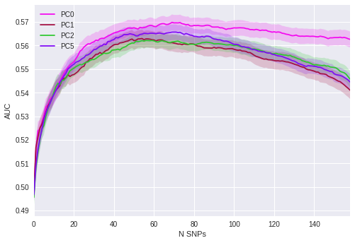
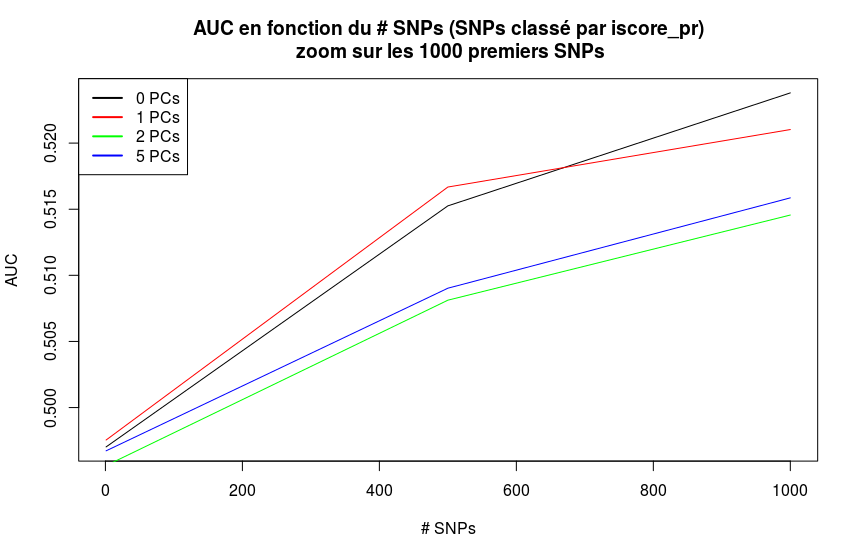
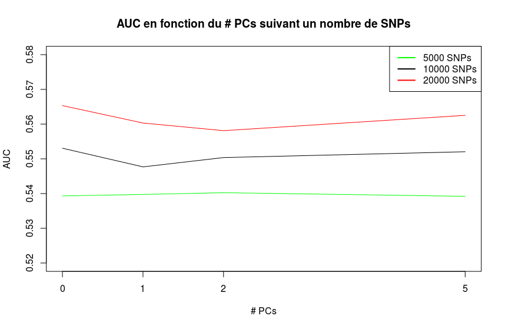

## Analyse sur les composantes principales.

### Classification (Cas vs. Controle)
#### __Ranking: Pvalue__
##### __Prediction VS. #SNPs__
Mesure de la prédiction (ou coefficents de prédictivité) en fonction du nombre de SNPs selon le nombre de Composantes Principale (PC) ajouté en covariables.

* _Calcul pente / plateau_

##### __Prediction VS. #PC__
Mesure de la prédiction (ou coefficents de prédictivité) en fonction du nombre de PCs selon le nombre de SNPs étudié (500/100/200/500/100/200).

#### __Ranking: I-score__
##### __Prediction VS. #SNPs__
Mesure de la prédiction (ou coefficents de prédictivité) en fonction du nombre de SNPs selon le nombre de Composantes Principale (PC) ajouté en covariables.

* _Calcul pente / plateau_

##### __Prediction VS. #PC__
Mesure de la prédiction (ou coefficents de prédictivité) en fonction du nombre de PCs selon le nombre de SNPs étudié (500/100/200/500/100/200).

#### __Ranking: Pvalue + Iscore__
##### __Prediction VS. #SNPs__
Mesure de la prédiction (ou coefficents de prédictivité) en fonction du nombre de SNPs selon le nombre de Composantes Principale (PC) ajouté en covariables.

* _Calcul pente / plateau_

##### __Prediction VS. #PC__
Mesure de la prédiction (ou coefficents de prédictivité) en fonction du nombre de PCs selon le nombre de SNPs étudié (500/100/200/500/100/200).

#### __Ranking: Beta__
##### __Prediction VS. #SNPs__
Mesure de la prédiction (ou coefficents de prédictivité) en fonction du nombre de SNPs selon le nombre de Composantes Principale (PC) ajouté en covariables.

### Regression (Age at onset)

#### __Prediction VS. #SNPs__
Mesure de la prédiction (ou coefficents de prédictivité) en fonction du nombre de SNPs selon le nombre de Composantes Principale (PC) ajouté en covariables.
* _Calcul pente / plateau_

#### __Prediction VS. #PC__
Mesure de la prédiction (ou coefficents de prédictivité) en fonction du nombre de PCs selon le nombre de SNPs étudié (500/100/200/500/100/200).

