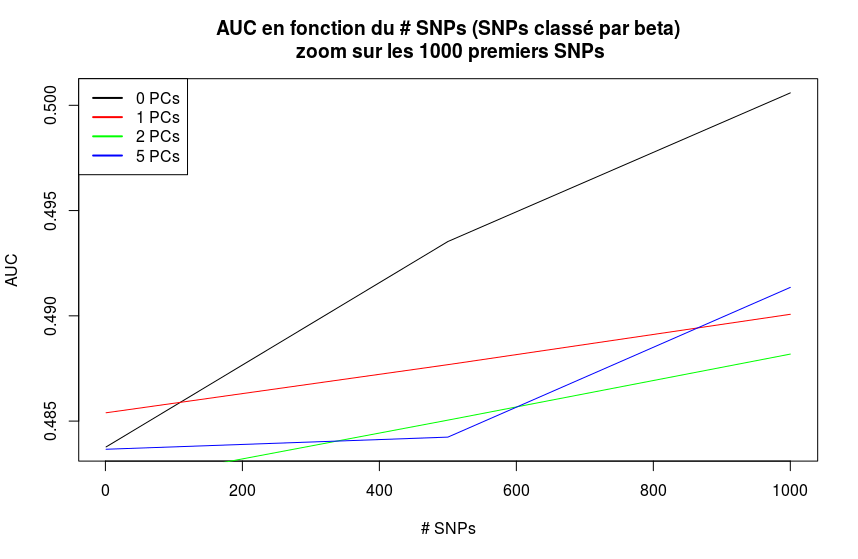
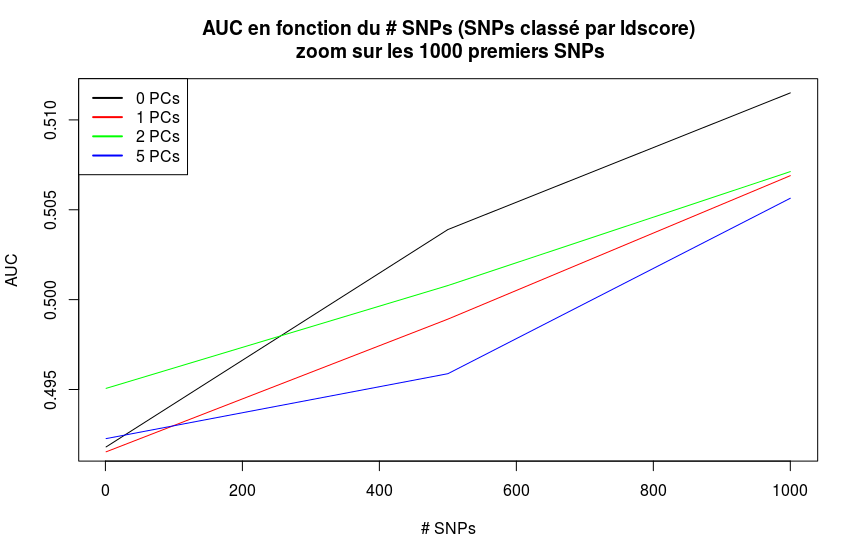

## Analyse sur les composantes principales.

### Introduction
--------------------------------------------
Les études d'association pangénomique (GWAS) constituent une approche efficace pour identifier les variantes génétiques associées au risque de maladie. La GWAS peut être biaisé par la stratification de la population correspondant à la présence observée de différence systématique dans les fréquences alléliques entre les populations humaines qui sont dues à des ancêtres différents.

L'analyse en composantes principales (ACP) est un outil qui a été utilisé pour déduire la structure de la population dans les données génétiques pendant plusieurs décennies, bien avant l'ère GWAS. 

La méthodologie utilisée classiquement pour corriger la stratification dans une GWAS consiste à utiliser les premières Composantes Principale (PC) comme covariables. L'Analyse en Composantes Principales (ACP) appliquera de façon appropriée une correction plus importante aux marqueurs présentant de grandes différences dans la fréquence des allèles entre les populations ancestrales. Mais l’intégration de ces covariables pourrait-elle être à l’origine d'une perte de l’information relative à la maladie ?

En effet, le travail effectué par Vincent Cabeli durant son stage de master 2 montré que le signal polygénique a été capturé à tort par les covariables de la stratification de la population entrainant une perte de 9% de prédictivité.

L'objectif de cette étude va être de mesurer la fluctutation de la prédictivité en fonction du nombre de composantes principales ajoutés au modèle. On va aussi s'interesser à l'impact de la méthode statistique utilisée sur le taux de prédictivité.  

On va s'interesser à l'impact de la méthode de classement des SNPs sur l'évaluation du score polygénique (utilisation du score de risque polygénique: ). 
### Classification (Cas vs. Controle)
--------------------------------------------
#### __Ranking: Pvalue__
##### __Prediction VS. #SNPs__
Mesure de la prédiction (ou coefficents de prédictivité) en fonction du nombre de SNPs selon le nombre de Composantes Principale (PC) ajouté en covariables.

* _Calcul pente / plateau_

##### __Prediction VS. #PC__
Mesure de la prédiction (ou coefficents de prédictivité) en fonction du nombre de PCs selon le nombre de SNPs étudié .

#### __Ranking: Beta__
##### __Prediction VS. #SNPs__
Mesure de la prédiction (ou coefficents de prédictivité) en fonction du nombre de SNPs selon le nombre de Composantes Principale (PC) ajouté en covariables.

* _Calcul pente / plateau_

##### __Prediction VS. #PC__
Mesure de la prédiction (ou coefficents de prédictivité) en fonction du nombre de PCs selon le nombre de SNPs étudié.

#### __Ranking: I-score__
##### __Prediction VS. #SNPs__
Mesure de la prédiction (ou coefficents de prédictivité) en fonction du nombre de SNPs selon le nombre de Composantes Principale (PC) ajouté en covariables.

* _Calcul pente / plateau_

##### __Prediction VS. #PC__
Mesure de la prédiction (ou coefficents de prédictivité) en fonction du nombre de PCs selon le nombre de SNPs étudié.

#### __Ranking: Pvalue + Iscore__
##### __Prediction VS. #SNPs__
Mesure de la prédiction (ou coefficents de prédictivité) en fonction du nombre de SNPs selon le nombre de Composantes Principale (PC) ajouté en covariables.

* _Calcul pente / plateau_

##### __Prediction VS. #PC__
Mesure de la prédiction (ou coefficents de prédictivité) en fonction du nombre de PCs selon le nombre de SNPs étudié.

#### __Ranking: ldscore__
##### __Prediction VS. #SNPs__
Mesure de la prédiction (ou coefficents de prédictivité) en fonction du nombre de SNPs selon le nombre de Composantes Principale (PC) ajouté en covariables.

* _Calcul pente / plateau_

##### __Prediction VS. #PC__
Mesure de la prédiction (ou coefficents de prédictivité) en fonction du nombre de PCs selon le nombre de SNPs étudié.

### Regression (Age at onset)
--------------------------------------------
#### __Prediction VS. #SNPs__
Mesure de la prédiction (ou coefficents de prédictivité) en fonction du nombre de SNPs selon le nombre de Composantes Principale (PC) ajouté en covariables.
* _Calcul pente / plateau_

#### __Prediction VS. #PC__
Mesure de la prédiction (ou coefficents de prédictivité) en fonction du nombre de PCs selon le nombre de SNPs étudié.

